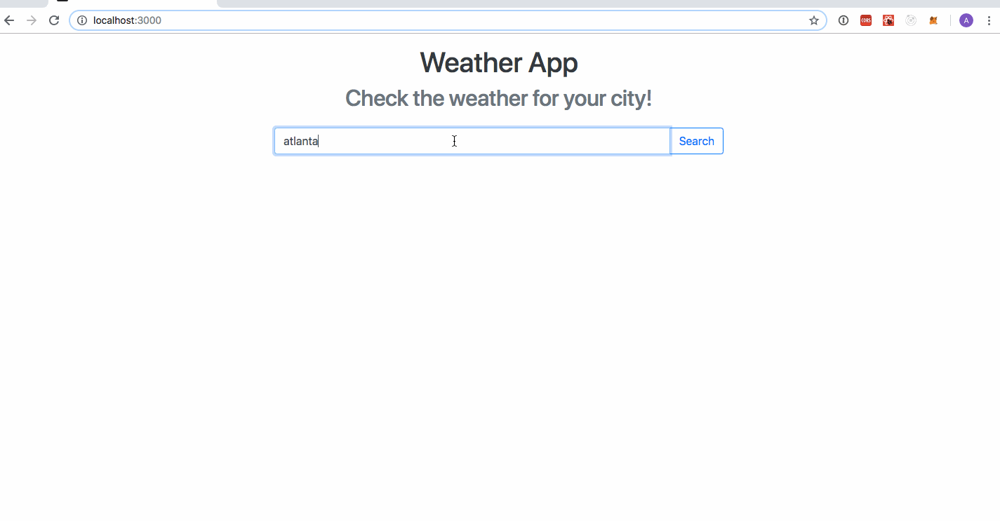

# Weather App

Weather-App uses the yahoo weather api to get real time weather data. Weather-App allows you to see the current temperature for your city as well as multiple cities. Weather-App can be used on any mobile device. If the page is refreshed or closed, the weather data still persists.




### Prerequisites

Heres how to get started. 

```
npm install
npm start
```
